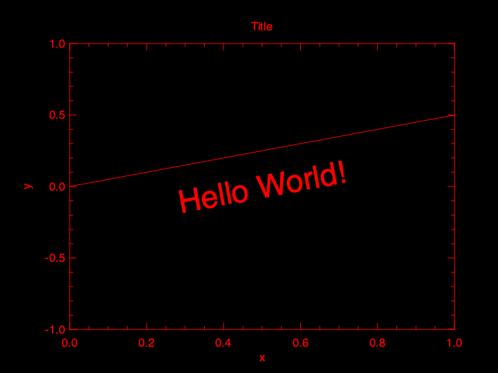
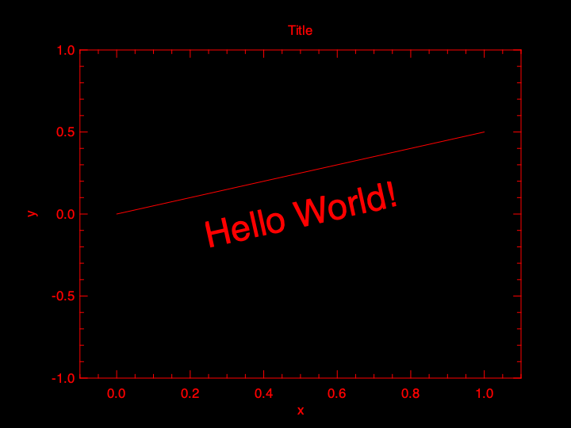
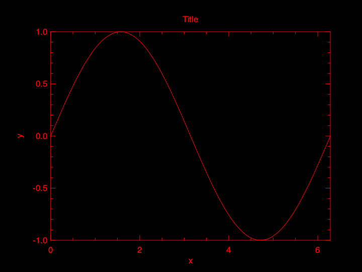
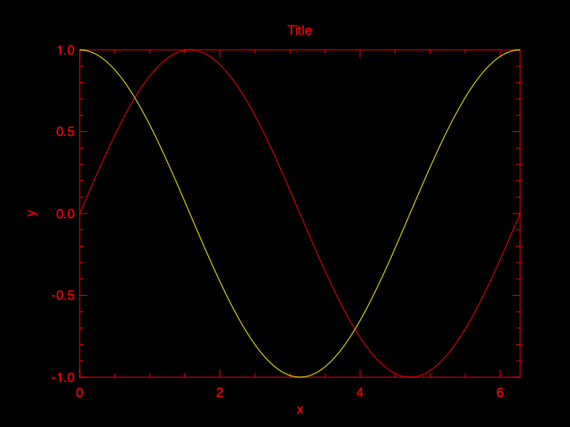
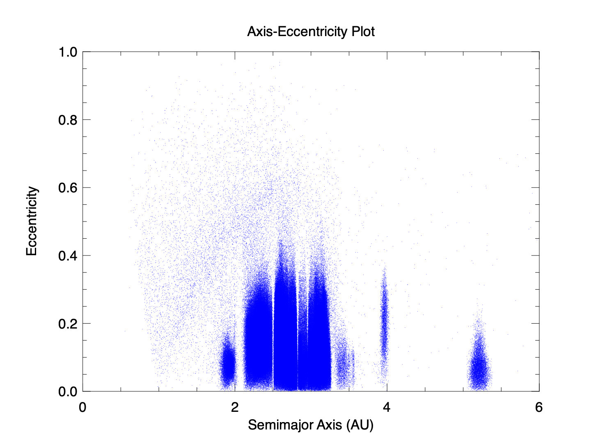

# Fortranから使うPLplot入門 #2

1. [Fortranから使うPLplot入門 #1](https://qiita.com/amasaki203/items/1dbeb02a2adb7265654d) - インストールとHello World
2. Fortranから使うPLplot入門 #2 - 直線と曲線、散布図を描く（この記事）

## はじめに

[Qiitaに挙げた初回の記事](https://qiita.com/amasaki203/items/1dbeb02a2adb7265654d)に引き続きPLplotの使い方について解説します。本稿では直線や曲線と、散布図の描き方について紹介します。

前回は、以下のメインプログラムでHello Worldを描きました。このコードの`frame`ブロックと`plot`ブロックに注目して、線分や曲線を引く方法についてみていきましょう。

```fortran
program main
   use plplot
   implicit none

   initialize: block
      call plinit
   end block initialize

   frame: block
      real(PLFLT), parameter :: xmin = 0d0, xmax = 1d0
      real(PLFLT), parameter :: ymin = -1d0, ymax = 1d0
      integer :: just, axis
      
      just = 0
      axis = 0
      call plenv( xmin, xmax, ymin, ymax, just, axis)
      call pllab("x", "y", "Title")
   end block frame

   plot: block
      real(PLFLT) :: cx, cy, dx, dy
      
      call plschr(12._plflt, 1._plflt)

      cx = 0.5d0
      cy = 0d0
      dx = 1d0
      dy = 0.5d0
      call plptex(cx, cy, dx, dy, 0.5_plflt, "Hello World!")
   end block plot

   finalize: block
      call plend
   end block finalize
 
end program main
```

## 目次

- [はじめに](#はじめに)
- [線を引く](#線を引く)
   - [線分を引く](#線分を引く)
   - [曲線を描く](#曲線を描く)
      - [サインカーブ](#サインカーブ)
      - [コサインを追加](#コサインを追加)
- [散布図を描く](#散布図を描く)
- [まとめ](#まとめ)
- [参考文献](#参考文献)

## 線を引く

### 線分を引く

線を引くためには、`plot`ブロックに`plline`手続を呼ぶ行を追加します。

`plline`は、x-y平面上の複数の点を線分で繋いだものを書き出します。引数には実数型ランク1の配列を2つとります。配列の添字が同じになる2つの値を、点のx座標とy座標の値とみなして、2つの点を結びます。例えば`call plline(x(:), y(:))`とすると、最初の点の座標は(`x(1)`, `y(1)`)、2番目の点は(`x(2)`, `y(2)`)というようになります。

```fortran
plot: block
   real(PLFLT) :: cx, cy, dx, dy
   call plschr(12._plflt, 1._plflt)

   cx = 0.5d0
   cy = 0d0
   dx = 1d0
   dy = 0.5d0
   call plptex(cx, cy, dx, dy, 0.5_plflt, "Hello World!")
   
   call plline([0d0,dx], [0d0,dy])  
    ! ここでは線分を引くためにサイズ2の配列を与えている。
end block plot
```

このコードを実行すると、次のような図が出力されます。

::: {class=large-img}



:::

この図では原点と点(1, 0.5)に線が引かれていますが、このままでは線分であることが明確ではないので`frame`ブロックを少し変更します。

```fortran
 frame: block
    real(PLFLT), parameter :: xmin = -0.1d0, xmax = 1.1d0 ! xminとxmaxを変更
    real(PLFLT), parameter :: ymin = -1d0, ymax = 1d0
    integer :: just, axis

    just = 0
    axis = 0
    call plenv( xmin, xmax, ymin, ymax, just, axis)
    call pllab("x", "y", "Title")
 end block frame
```

これを反映したプログラムを実行すると、次のようになります。

::: {class=large-img}



:::

これで線分を引くことができました。これに加えて、前回の記事で
「`plptex`手続では、文字列を置く座標を`cx = 0.5d0; cy = 0d0`とし、その傾きを原点と点` dx = 1d0; dy = 0.5d0`のなす直線に並行になるように指定しています」
と書きましたが、この図はまさに、文字列の傾きが原点と点(`dx`, `dy`)を結ぶ直線に並行であることを示しています。

### 曲線を描く

#### サインカーブ

前節では`plline`を使って線分を引きました。この手続は、与える配列のサイズを十分大きいものにすると、曲線を引くことができます。

まずは簡単なSin曲線を引いてみましょう。まずは`frame`ブロックの`xmin`, `xmax`, `ymin`, `ymax`をグローバル定数に移し、`xmax`には2πを代入します。

```fortran
program main
   use plplot
   implcit none
   real(PLFLT), parameter :: pi = acos(-1d0)
   real(PLFLT), parameter :: xmin = 0d0, xmax = 2*pi
   real(PLFLT), parameter :: ymin = -1d0, ymax = 1d0
   ...

   frame: block
      integer :: just, axis

      just = 0
      axis = 0
      call plenv( xmin, xmax, ymin, ymax, just, axis)
      call pllab("x", "y", "Title")
   end block frame
   ...
```

次に`plot`ブロックを次のように変更します。

```fortran
plot: block
   integer, parameter :: n = 101
   integer, :: i
	 real(PLFLT) :: x(n), y_sine(n)
	 
	 do i = 1, n
      x(i) = (i-1)*(xmax - xmin)/(n-1)
      y_sine(i) = sin(x(i))
   end do
   call plline(x, y_sine)
end block plot
```

配列`x`には、x軸方向の区間を`n-1`個に分割したものの境界（`n`個）の座標値を代入しています。配列`y`の第`i`要素には、x座標上の位置`x(i)`のSin関数の値を代入しています。

以上の変更を行い、プログラムを実行すると、次のような図が出力されるでしょう。

::: {class=large-img}



:::

#### コサインを追加

次にCos関数の曲線を追加しますが、ここでは線の色を変えてみましょう。`plot`ブロックを以下のように変更します。

```fortran
 plot: block
    integer, parameter :: n = 101
    integer :: i
    real(PLFLT) :: x(n), y_sine(n), y_cosine(n)

    do i = 1, n
       x(i) = (i-1)*(xmax - xmin)/(n-1)
       y_sine(i) = sin(x(i))
       y_cosine(i) = cos(x(i))
    end do
    call plline(x, y_sine)

    call plcol0(2)
    call plline(x, y_cosine)
 end block plot
```

新しいこのコードでは、配列`y_cosine`を追加しています。8行目でこの配列にCos関数の値を代入しています。次に`plcol0(2)`を呼び出して、その後に描画する色を変更しています。最後に`plline(x, y_cosine)`を呼び出して曲線を描画しています。これを実行すると以下のようなプロットを得られます。


::: {class=large-img}



:::


プロットする色を変更する`plcol0`手続について解説します。このサブルーチンは`0`以上の整数値を引数に取り、その手続を呼び出して以降に描画するものの色を番号で対応づけられたものに変更します。番号と色の対応は`cmap0_default.pal`というファイルにHEXカラーコードで定義されています。以下のコマンドは、macOS上でMacPortsを使ってPLplotをインストールしている場合の例です。

```
% ls /opt/local/share/plplot5.15.0 | grep .pal
cmap0_alternate.pal
cmap0_black_on_white.pal
cmap0_default.pal
cmap0_white_bg.pal
cmap1_blue_red.pal
cmap1_blue_yellow.pal
cmap1_default.pal
cmap1_gray.pal
cmap1_highfreq.pal
cmap1_lowfreq.pal
cmap1_radar.pal

% cat /opt/local/share/plplot5.15.0/cmap0_default.pal
16
#000000
#ff0000
#ffff00
#00ff00
#7fffd4
#ffc0cb
#f5deb3
#bebebe
#a52a2a
#0000ff
#8a2be2
#00ffff
#40e0d0
#ff00ff
#fa8072
#ffffff
```

`call plcol0(2)`の`2`に対応するのは、`cmap0_default.pal`にリストされている値の3番目（0-basedのため）、つまり`#ffff00`なので黄色に変更しています。

## 散布図を描く

前節までに、文字列を書くことと線を引くことができるようになりました。この節では、点を打って散布図を描く方法について解説します。ここでは、次のような図をプロットすることを目標にします。

::: {class=large-img}



:::

プロットするデータの例として、国際天文学連合の[Minor Planet Center](https://www.minorplanetcenter.net/iau/MPCORB.html)からMOBCORB.DATのデータをダウンロードして使用します。このデータファイルは小天体の軌道に関するデータなどが含まれています。小惑星は楕円軌道で運行しているので、軌道を特徴づけるパラメーターの一部である**軌道長半径a**と**軌道離心率e**の値を取り出します。

ダウンロードできたら、まずはこのファイルをFortranで読み取りやすいように加工します（完全なデータフォーマットは[Export Format for Minor-Planet Orbits - IAU/MPC](https://www.minorplanetcenter.net/iau/info/MPOrbitFormat.html)に書かれています）。ファイルには説明文とヘッダが含まれているので、以下のコマンドを実行してこれを取り除きます（もしくはテキストエディタでデータ部分以外を切り取ってもかまいません）。

```
% cat MPCORB.DAT | awk 'NR>= 44' > MPCORB_modified.DAT
```

次にデータを読み込んでプロットを描くコードについて説明していきます。プログラムの先頭は以下のように記述します。

```fortran
program main
   use plplot
   implicit none
   real(PLFLT), parameter :: xmin = 0d0, xmax = 6d0
   real(PLFLT), parameter :: ymin = 0d0, ymax = 1d0
   integer, parameter :: n = 1500000
   real(PLFLT) :: x(n), y(n)

   ! 値をプロット範囲外の値で初期化する。
   x(:) = -1d0
   y(:) = -1d0
```

そして、次のような`read_data`ブロックを追加して、`MPCORB_modified.DAT`からデータを読み込みます。

```fortran
 read_data: block
    character(7) :: id
    character(5) :: epoch
    real(PLFLT) :: h, g, perihelion, epoch_ano, lon_asc, inclination, ecc, mean_motion, a
    	! 使用するのはeccとaのみで、他はダミー変数
    integer :: uni, i, ierr

    open(newunit=uni, file='MPCORB_modified.DAT', status='old')

    i = 1
    ierr = 0
    do while (.true.)
       if (ierr /= 0) then
          exit
       end if
       read(uni, *, iostat=ierr)  &
          id, h, g, epoch, epoch_ano, perihelion, &
          lon_asc, inclination, ecc, mean_motion, a
          ! 1レコードには、第9列に軌道離心率eが、第11列に軌道長半径aが配置されているので、
          ! これらを変数eccとaに読み込む

       x(i) = a
       y(i) = ecc
       i = i + 1
    end do
    close(uni)
 end block read_data
```

次に`initialize`, `frame`, `plot`ブロックを次のように記述します。

```fortran
initialize: block
   call plspal0('cmap0_white_bg.pal')  ! このパレットファイルを使用して、背景色を白にする
   call plspage(0._plflt, 0._plflt, 1440, 1080, 0, 0)
      ! 画像の大きさを1440x1080ピクセルに設定する
   call plinit
end block initialize

frame: block
   integer :: just, axis

   just = 0
   axis = 0
   call plcol0(15) ! 色を黒に切り替える（座標軸とラベルのため）
   call plenv( xmin, xmax, ymin, ymax, just, axis)
   call pllab("Semimajor Axis (AU)", "Eccentricity", "Axis-Eccentricity Plot")
end block frame

plot: block
   integer :: code

   code = -1
   call plcol0(9) ! 色を青に切り替える（プロットする点のため）
   call plpoin(x, y, code)
end block plot
```

`plot`ブロックでは、`plpoin`手続を使用して点をプロットする処理を実行しています。`plpoin`に配列`x`, `y`を与えるのは`plline`と同様ですが、引数としてもう一つ、点として打つグリフ（字体）を指定する値を第3引数に渡す必要があります（ここでは`code`）。変数`code`は-1以上127以下の値を指定します。上のコードでは`code = -1`としていますが、これは単に点を描画するだけを意味します。そのほかにプロット可能なグリフは[公式サイトのExample 6](https://plplot.sourceforge.net/examples.php?demo=06&lbind=Fortran)で見ることができます。

なお、[`plspal0`](https://plplot.sourceforge.net/docbook-manual/plplot-html-5.15.0/plspal0.html), [`plspage`](https://plplot.sourceforge.net/docbook-manual/plplot-html-5.15.0/plspage.html) の手続に関しては次回以降の記事で解説したいと思います。

以下にプログラム全体を示します。

```fortran
program main
   use plplot
   implicit none
   real(PLFLT), parameter :: xmin = 0d0, xmax = 6d0
   real(PLFLT), parameter :: ymin = 0d0, ymax = 1d0

   integer, parameter :: n = 1500000
   real(PLFLT) :: x(n), y(n)

   x(:) = -1d0
   y(:) = -1d0

   read_data: block
      character(7) :: id
      character(5) :: epoch
      real(PLFLT) :: h, g, perihelion, epoch_ano, lon_asc, inclination, ecc, mean_motion, a
      integer :: uni, i, ierr

      open(newunit=uni, file='MPCORB_modified.DAT', status='old')
   
      i = 1
      ierr = 0
      do while (.true.)
         if (ierr /= 0) then
            exit
         end if
         read(uni, *, iostat=ierr)  &
            id, h, g, epoch, epoch_ano, perihelion, &
            lon_asc, inclination, ecc, mean_motion, a

         x(i) = a
         y(i) = ecc
         i = i + 1
      end do
      close(uni)
   end block read_data

   initialize: block
      call plspal0('cmap0_white_bg.pal')  ! このパレットファイルを使用して、背景色を白にする
      call plspage(0._plflt, 0._plflt, 1440, 1080, 0, 0) 
         ! 画像の大きさを1440x1080ピクセルに設定する
      call plinit
   end block initialize

   frame: block
      integer :: just, axis
   
      just = 0
      axis = 0
      call plcol0(15) ! 色を黒に切り替える（座標軸とラベルのため）
      call plenv( xmin, xmax, ymin, ymax, just, axis)
      call pllab("Semimajor Axis (AU)", "Eccentricity", "Axis-Eccentricity Plot")
   end block frame

   plot: block
      integer :: code
      
      code = -1
      call plcol0(9) ! 色を青に切り替える（プロットする点のため）
      call plpoin(x, y, code)
   end block plot

   finalize: block
      call plend
   end block finalize

end program main
```

このコードを実行すると、この節の冒頭で示したような画像が出力されます。これで散布図を描くことができるようになりました。

## まとめ

今回はPLplotを使って、直線と曲線、散布図の書き方について説明しました。線を引くには`plline`を使い、点を打つには`plpoin`を使いますが、x軸とy軸の値を配列としてまとめて引数として渡すことは共通しています。座標軸や背景色等を変更する方法の詳細にはほとんど触れていませんが、次回以降の記事で解説したいと思います。

## 参考文献

1. [IAU/Minor Planet Center](https://www.minorplanetcenter.net/iau/MPCORB.html)
2. [Export Format for Minor-Planet Orbits - IAU/MPC](https://www.minorplanetcenter.net/iau/info/MPOrbitFormat.html)
3. [PLplot - Examples](https://plplot.sourceforge.net/examples.php): [Example 6](https://plplot.sourceforge.net/examples.php?demo=06&lbind=Fortran) 
4. [Documentation of the PLplot plotting software - v5.15.0](https://plplot.sourceforge.net/docbook-manual/plplot-html-5.15.0/index.html): [`plline`](https://plplot.sourceforge.net/docbook-manual/plplot-html-5.15.0/plline.html),  [`plpoin`](https://plplot.sourceforge.net/docbook-manual/plplot-html-5.15.0/plpoin.html), [`plspal0`](https://plplot.sourceforge.net/docbook-manual/plplot-html-5.15.0/plspal0.html), [`plspage`](https://plplot.sourceforge.net/docbook-manual/plplot-html-5.15.0/plspage.html) 
