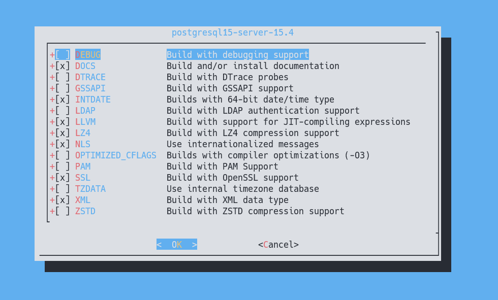
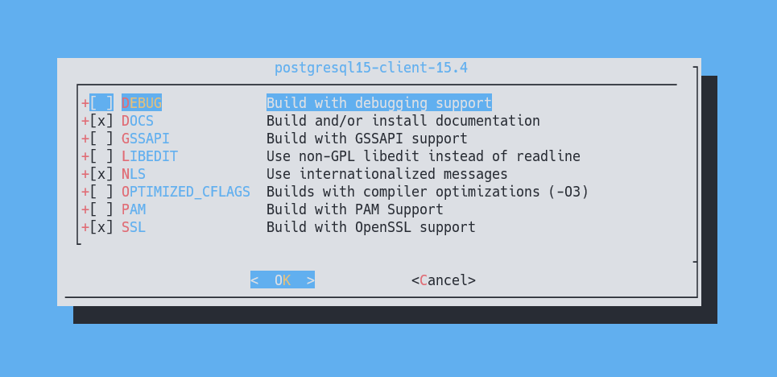

# FreeBSD 13.2にPostgreSQL 15をインストールする（前編）

Author: Amasaki Shinobu (雨崎しのぶ)

Twitter: [@amasaki203](https://twitter.com/amasaki203)

Posted on: 2023-09-12 JST

## 概要

本稿では、FreeBSDのマシンにPostgreSQL15をインストールする方法について、できるだけ詳細に述べる。インストールに際してはportsによってソースコードからビルドをしてインストールする。重要な依存パッケージであるLLVMについてもportsからビルドしてインストールする。最後にローカルネットワークの別ホストからインストールしたPostgreSQLへアクセスする手順についても述べる。

## 目次

- [概要](#概要)
- [目標](#目標)
- [前準備](#前準備)
  - [portsの準備](#portsの準備)
  - [LLVMのインストール](#llvmのインストール)
- [PostgreSQLのインストール](#postgresqlのインストール)
-  [データベースサーバーのセットアップ](#データベースサーバーのセットアップ)
  - [インストール時メッセージの詳細について](#インストール時メッセージの詳細について)
  - [セットアップの実行](#セットアップの実行)
  - [LANからのアクセスを有効にする](#lanからのアクセスを有効にする)
    - [`postgresql.conf`](#postgresql.conf)
    - [`pg_hba.conf`](#pg_hba.conf)
    - [PostgreSQLの再起動と接続の確認](#postgresqlの再起動と接続の確認)
- [最後に](#最後に)
- [参考文献](#参考文献)

## 目標

#### 前編の目標

1. PostgreSQL 15.4をportsでビルドし、インストールする。

2. 依存パッケージの一つであるLLVMもportsでビルドする。
   - LLVM Flangもインストールする。

3. LAN内の他ホスト（192.168.0.0/24, 192.168.11.0/24）から`psql`コマンドでアクセスできるようにする。
   - インターネット経由のアクセスは想定しない。
   - パケットフィルタリングは無効の状態を想定するので、読者は必要に応じて有効にして欲しい。

#### 後編の目標

- phpPgAdminをインストールして、LANのホストのブラウザからアクセスできるようにする。

これの実現には以下のWebサーバーパッケージをインストールして稼働させる必要がある。

- Apache HTTP Server（`apache24`）
- PHP FastCGI Process Manager（`php-fpm`）

## インストールする環境

以下にハードウェアとOS、ネットワークについての要点を挙げる。

- OS：FreeBSD 13.2-RELEASE
  - シェルは`zsh`を使用する（コードブロックにはプロンプト`%`を使用していることに注意）
  - `sudo`が使用可能なことを前提とする。
- ハードウェア：Fujitsu Esprimo D583/KX
  - メモリ：DDR3 32GB
  - CPU: Intel(R) Core(TM) i5-4590 CPU @ 3.30GHz (4コア)
  - ストレージ：Sandisk SSD Plus 240GB
  - NIC
    - Intel(R) PRO/1000 PT 82572EI (Copper)
    - RealTek 8168/8111 PCIe Gigabit Ethernet
- ネットワーク
  - Intel: 192.168.0.243/24
  - RealTek: 192.168.11.13/24
  - 192.168.0.0/24ネットワークと192.168.11.0/24ネットワークはブリッジを介して接続されている。


## 前準備

### portsの準備

先に`pkg`コマンドを使ってGitをインストールする。

```shell
% sudo pkg install git
```

（加えてCMakeとNinjaとGNU Makeもインストールしておくことにする。）

```shell
% sudo pkg install cmake ninja gmake
```

portsツリーをローカルにコピーして配置する。転送量が1GiB程度あるので時間がかかる。

```shell
% sudo git clone https://git.FreeBSD.org/ports.git /usr/ports
```

必要に応じて`/usr/ports`をアップデートする。

```shell
% sudo git -C /usr/ports pull
```

### LLVMのインストール

PostgreSQLのビルドにはLLVMが必要となる。このパッケージは非常に大きく、また依存パッケージも多い。インストールがエラーで失敗したときに問題に対処しやすくするため、PostgreSQLに先立って、予めLLVMのパッケージをインストールしておく。

PostgreSQL 15.4に対応するLLVMのバージョンは**15**なので、`llvm15`のportをインストールする。

```shell
% cd /usr/ports/devel/llvm15
% cat pkg-descr
The LLVM Project is a collection of modular and reusable compiler and
toolchain technologies.

This port includes Clang (a C/C++/Objective-C compiler), LLD (a linker),
LLDB (a debugger), an OpenMP runtime library, and the LLVM infrastructure
these are built on.
```

`make config`コマンドでビルドの設定を行う。

```shell
% sudo make config
```

以下のような画面になり、ビルドオプションを設定できる（任意のオプションだが、ここではFlangのビルドを有効にしておく）。

::: {class=large-img}

:::

`make`コマンドでビルドを実行する。

```shell
% sudo make
...(依存パッケージのインストールを含め、多くの出力がある)
```

このコマンドの実行中に、依存関係のパッケージのインストールも行われるので、途中で上と似たような設定画面が複数回でることになるだろう。ここでは、依存パッケージのビルド設定はデフォルト通りで変更せずに行った。

**注**：LLVMのパッケージをインストールをする際の`make`コマンドの実行には、**`-j`オプションを使わない**ほうがよい。これは依存関係のパッケージのインストールで失敗することが多いためである。どのみちLLVM自体のビルドにはNinjaが使われることになるので、NinjaがCPUのコア数をフルに活用してくれる。本稿では他のportsのインストールにおいても、`make`コマンドに`-j`オプションを使用しない。

問題なくビルドに成功すれば、以下のようなメッセージが最後に出て終了となる。このパッケージはビルド対象のオブジェクトの数が多く、今回はおよそ9000個で、このCPU（4コア）では3時間ほどかかった。

```shell
====> Compressing man pages (compress-man)
===> Staging rc.d startup script(s)
```

最後に`make install`でインストールを実行する。

```shell
% sudo make install
```

ここでのインストールで作成されたコンパイラの実行ファイルは`/usr/local/bin`に配置される。`clang15`、`clang++15`、`flang15`にPATHが通った状態を確認して、LLVMのインストールは完了となる。
```
% type clang15
clang15 is /usr/local/bin/clang15

% type clang++15
clang++15 is /usr/local/bin/clang++15

% type flang15
flang15 is /usr/local/bin/flang15
```

## PostgreSQLのインストール

2023年現在、portsにはPostgreSQL11から16までのバージョンが存在する。

```shell
% ls -1d /usr/ports/databases/postgresql*-server
/usr/ports/databases/postgresql11-server
/usr/ports/databases/postgresql12-server
/usr/ports/databases/postgresql13-server
/usr/ports/databases/postgresql14-server
/usr/ports/databases/postgresql15-server
/usr/ports/databases/postgresql16-server
```

本稿ではバージョン15を対象とするので、`/usr/ports/databases/postgresq15-server`をインストールする。

カレントディレクトリを移動し、`make config`コマンドを実行する。

```shell
% cd /usr/ports/databases/postgresql15-server
% sudo make config
```

::: {class=large-img}

:::

上のようなビルドオプションとした。`GSSAPI`は、使う予定がないのでここでは指定していない。

`make`コマンドを実行する。

```shell
% sudo make
```

`postgresql15-server`は依存パッケージとしてクライアントのパッケージである`postgresql15-client`を含んでいるので、`make`コマンドの実行中にビルド設定を聞かれることになる。クライアントのビルド設定は以下の通りとした。

::: {class=large-img}



:::

ビルドが成功したら`make install`コマンドでインストールを実行する。以下のような長いメッセージがでて、インストールは完了である。

```shell 
% sudo make install
===>  Installing for postgresql15-server-15.4
===>  Checking if postgresql15-server is already installed
===>   Registering installation for postgresql15-server-15.4
Installing postgresql15-server-15.4...
===> Creating groups.
Creating group 'postgres' with gid '770'.
===> Creating users
Creating user 'postgres' with uid '770'.
===> Creating homedir(s)

  =========== BACKUP YOUR DATA! =============
  As always, backup your data before
  upgrading. If the upgrade leads to a higher
  major revision (e.g. 9.6 -> 10), a dump
  and restore of all databases is
  required. This is *NOT* done by the port!
  See https://www.postgresql.org/docs/current/upgrading.html
  ===========================================
For procedural languages and postgresql functions, please note that
you might have to update them when updating the server.

If you have many tables and many clients running, consider raising
kern.maxfiles using sysctl(8), or reconfigure your kernel
appropriately.

The port is set up to use autovacuum for new databases, but you might
also want to vacuum and perhaps backup your database regularly. There
is a periodic script, /usr/local/etc/periodic/daily/502.pgsql, that
you may find useful. You can use it to backup and perform vacuum on all
databases nightly. Per default, it performs `vacuum analyze'. See the
script for instructions. For autovacuum settings, please review
~postgres/data/postgresql.conf.

If you plan to access your PostgreSQL server using ODBC, please
consider running the SQL script /usr/local/share/postgresql/odbc.sql
to get the functions required for ODBC compliance.

Please note that if you use the rc script,
/usr/local/etc/rc.d/postgresql, to initialize the database, unicode
(UTF-8) will be used to store character data by default.  Set
postgresql_initdb_flags or use login.conf settings described below to
alter this behaviour. See the start rc script for more info.

To set limits, environment stuff like locale and collation and other
things, you can set up a class in /etc/login.conf before initializing
the database. Add something similar to this to /etc/login.conf:
---
postgres:\
        :lang=en_US.UTF-8:\
        :setenv=LC_COLLATE=C:\
        :tc=default:
---
and run `cap_mkdb /etc/login.conf'.
Then add 'postgresql_class="postgres"' to /etc/rc.conf.

======================================================================

To initialize the database, run

  /usr/local/etc/rc.d/postgresql initdb

You can then start PostgreSQL by running:

  /usr/local/etc/rc.d/postgresql start

For postmaster settings, see ~postgres/data/postgresql.conf

NB. FreeBSD's PostgreSQL port logs to syslog by default
    See ~postgres/data/postgresql.conf for more info

NB. If you're not using a checksumming filesystem like ZFS, you might
    wish to enable data checksumming. It can be enabled during
    the initdb phase, by adding the "--data-checksums" flag to
    the postgresql_initdb_flags rcvar. Otherwise you can enable it later by
    pg_checksums.  Check the initdb(1) manpage for more info
    and make sure you understand the performance implications.

======================================================================

To run PostgreSQL at startup, add
'postgresql_enable="YES"' to /etc/rc.conf

===> SECURITY REPORT:
      This port has installed the following files which may act as network
      servers and may therefore pose a remote security risk to the system.
/usr/local/bin/postgres

      If there are vulnerabilities in these programs there may be a security
      risk to the system. FreeBSD makes no guarantee about the security of
      ports included in the Ports Collection. Please type 'make deinstall'
      to deinstall the port if this is a concern.

      For more information, and contact details about the security
      status of this software, see the following webpage:
https://www.postgresql.org/
```

これでPostgreSQLがシステムにインストールされた。設定ファイルは主に`/usr/local/etc/p

これらのメッセージの解説と指示の実行は、次のセクションで詳しく述べる。

## データベースサーバーのセットアップ

### インストール時メッセージの詳細について

#### ユーザー`postgres`

```shell
===> Creating groups.
Creating group 'postgres' with gid '770'.
===> Creating users
Creating user 'postgres' with uid '770'.
===> Creating homedir(s)
```

これらは、データベース管理システム内の特権ユーザー`postgres`が、その名前のグループとユーザーがFreeBSDのOSのシステムにも作られたことを示しているメッセージである。そのgidとuidは共に`770`であり、これは`/etc/group`と`/etc/passwd`に記述で確かめることができる。

```shell
% cat /etc/passwd | grep postgres
postgres:*:770:770:PostgreSQL Daemon:/var/db/postgres:/bin/sh
```

ここで`/var/db/postgres`はOSのユーザー`postgres`のホームディレクトリである。

#### バックアップに関する注意書き


>  =========== BACKUP YOUR DATA! =============
>
>  As always, backup your data before
>  upgrading. If the upgrade leads to a higher
>  major revision (e.g. 9.6 -> 10), a dump
>  and restore of all databases is
>  required. This is *NOT* done by the port!
>
>  See https://www.postgresql.org/docs/current/upgrading.html
>
>  ==========================================


これは、PostgreSQLをアップグレードする前にかならずデータベースのダンプとレストアをユーザー自身が自分で行わなければならないことを指示する注意書きである。これらの操作はportによって**自動的に行われない**ことに注意する必要がある。

#### アップデートに関する注意書き

中段の最初の段落は、以下のように書かれている。

> For procedural languages and postgresql functions, please note that
> you might have to update them when updating the server.


日本語にすると、以下のように訳すことができるだろう。

「プロシージャル言語とPostgreSQLの関数について、サーバーを更新する際にはそれらを更新する必要があるかもしれません。」


ここで、procedual languageとは、データベース内でストアドプロシージャ、ユーザー定義関数などのプログラムを作成して実行するために`CREATE LANGUAGE`文で作成されたプロシージャル言語を指す。


次に、データベースの規模に応じて設定を見直すように記述されている。

> If you have many tables and many clients running, consider raising
> kern.maxfiles using sysctl(8), or reconfigure your kernel
> appropriately.

「多くのテーブルを持ち、多くのクライアントが実行中の場合、`sysctl(8)`を使用して、kern.maxfilesを増やすか、カーネルを適切に再構成することを検討してください。」


これはデータベースの規模が大きい場合には、カーネルの設定を見直すことを促している。


そして、バキュームについて書かれている。

> The port is set up to use autovacuum for new databases, but you might
> also want to vacuum and perhaps backup your database regularly. There
> is a periodic script, /usr/local/etc/periodic/daily/502.pgsql, that
> you may find useful. You can use it to backup and perform vacuum on all
> databases nightly. Per default, it performs `vacuum analyze'. See the
> script for instructions. For autovacuum settings, please review
> ~postgres/data/postgresql.conf.

「portは新しいデータベースに対して自動バキュームを使用するように設定されていますが、定期的にデータベースをバキュームし、バックアップを取得したいと考えるかもしれません。そのための定期的なスクリプトとして`/usr/local/etc/periodic/daily/502.pgsql`が用意されており、便利に使えるでしょう。これを使用してすべてのデータベースに対して夜間にバックアップを取得し、バキュームを実行することができます。デフォルトでは、これは「バキューム解析」を実行します。詳細な手順についてはスクリプトを参照してください。自動バキュームの設定については`~postgres/data/postgresql.conf`を確認してください。」


ここで、**バキューム**とは、データベース内の不要なデータやリソースを削除することである。PostgreSQLの通常の動作では、削除されたもしくは更新によって不要になったレコードはテーブルからは物理的には削除されず、`VACUUM`が実行されるまで残っている。この操作によって、不要なデータを削除して、データベースを最適化しパフォーマンス向上をすることができる。


更に、ODBCに関しての注意書きがある。

> If you plan to access your PostgreSQL server using ODBC, please
> consider running the SQL script /usr/local/share/postgresql/odbc.sql
> to get the functions required for ODBC compliance.

「PostgreSQLサーバーへODBC経由でアクセスする予定がある場合、ODBCに準拠に必要な関数を取得するためのSQLスクリプト`/usr/local/share/postgresql/odbc.sql`を実行することを検討してください。」


ここで**ODBC**とはopen database connectivityの略称で、アプリケーションソフトウェアがデータベース管理システムに接続して、データ参照や書き込み、操作を行う際の標準を定めたものである。

#### データベース初期化に関する注意書き

その次には、重要なことだが、文字コードに関する注意書きがある。


> Please note that if you use the rc script,
> /usr/local/etc/rc.d/postgresql, to initialize the database, unicode
> (UTF-8) will be used to store character data by default.  Set
> postgresql_initdb_flags or use login.conf settings described below to
> alter this behaviour. See the start rc script for more info.


「データベースの初期化にrcスクリプト`/usr/local/etc/rc.d/postgresql`を使用する場合、デフォルトでは文字データを格納する場合にunicode（UTF-8）が使われることに注意してください。この動作を変更するには、`postgresql_initdb_flags`を設定するか、以下で説明されている`login.conf`の設定を使用してください。詳細については、起動用のrcスクリプトを参照してください。」

> To set limits, environment stuff like locale and collation and other
> things, you can set up a class in /etc/login.conf before initializing
> the database. Add something similar to this to /etc/login.conf:
> 
> ```shell
> postgres:\
>         :lang=en_US.UTF-8:\
>         :setenv=LC_COLLATE=C:\
>         :tc=default:
> ```
>
> and run `cap_mkdb /etc/login.conf'`.
> Then add 'postgresql_class="postgres"' to /etc/rc.conf.

「制限やロケール、照合順序などの環境設定を行うには、データベースを初期化する前に`/etc/login.conf`内にクラスを設定することができます。以下のような設定を`/etc/login.conf`を追加し、`cap_mkdb /etc/login.conf`を実行してください。

```
postgres:\
        :lang=en_US.UTF-8:\
        :setenv=LC_COLLATE=C:\
        :tc=default:
```

その後、`/etc/rc.conf`に、`postgresql_class="postgres"`を追加してください。」

これらの設定を行うことで、PostgreSQLデータベースの初期化時に指定したクラスが適用される。


しかし、今回のインストールではデフォルトの設定のまま初期化するのでこれらの操作は使用しなかった。


その次には、初期化とPostgreSQLの起動について書かれている。


> To initialize the database, run
> 
> ```shell
>   /usr/local/etc/rc.d/postgresql initdb
> ``` 
>
> You can then start PostgreSQL by running:
> 
> ```shell
>   /usr/local/etc/rc.d/postgresql start
> ``` 
>
> For postmaster settings, see `~postgres/data/postgresql.conf`
> 
> NB. FreeBSD's PostgreSQL port logs to syslog by default
>     See ~postgres/data/postgresql.conf for more info
> 
> NB. If you're not using a checksumming filesystem like ZFS, you might
>     wish to enable data checksumming. It can be enabled during
>     the initdb phase, by adding the "--data-checksums" flag to
>     the postgresql_initdb_flags rcvar. Otherwise you can enable it later by
>     pg_checksums.  Check the initdb(1) manpage for more info
>     and make sure you understand the performance implications.


「データベースを初期化するには以下を実行する：

```shell
/usr/local/etc/rc.d/postgresql initdb
```

その後、以下を実行することでPostgreSQLを起動することができる：

```shell
/usr/local/etc/rc.d/postgresql start
```

ポストマスター（データベースのメインプロセス）の設定については、`~postgres/data/postgresql.conf`を参照してください。

注意事項

- FreeBSDのPostgreSQLのportはデフォルトでsyslogにログを記録します。詳細については`~postgres/data/postgresql.conf`を参照してください。
- ZFSなどのチェックサムのあるファイルシステムを使用していない場合、データのチェックサムを有効にすることを検討することがあるかもしれません。これは`initdb`フェーズ中に`postgresql_initdb_flags`のrc変数に`--data-checksums`フラグを追加することで有効にできます。それ以外の場合、後から`pg_checksums`を使用して有効にすることもできます。パフォーマンスへの影響も理解するため、詳細については`initdb(1)`のマニュアルページも確認してください。」

今回のインストールでは、ディスクのファイルシステムにZFSを使用しているので、PostgreSQLのチェックサムは有効にしない。


最後にセキュリティレポートについての記載がある。

> ===> SECURITY REPORT:
> This port has installed the following files which may act as network
> servers and may therefore pose a remote security risk to the system.
>
> `/usr/local/bin/postgres`
> 
> If there are vulnerabilities in these programs there may be a security
> risk to the system. FreeBSD makes no guarantee about the security of
> ports included in the Ports Collection. Please type 'make deinstall'
> to deinstall the port if this is a concern.
>
> For more information, and contact details about the security
> status of this software, see the following webpage:
>
> https://www.postgresql.org/


### セットアップの実行

initdbを実行する。

```
% sudo /usr/local/etc/rc.d/postgresql initdb

The files belonging to this database system will be owned by user "postgres".
This user must also own the server process.

The database cluster will be initialized with this locale configuration:
  provider:    libc
  LC_COLLATE:  C
  LC_CTYPE:    C.UTF-8
  LC_MESSAGES: C.UTF-8
  LC_MONETARY: C.UTF-8
  LC_NUMERIC:  C.UTF-8
  LC_TIME:     C.UTF-8
The default text search configuration will be set to "english".

Data page checksums are disabled.

creating directory /var/db/postgres/data15 ... ok
creating subdirectories ... ok
selecting dynamic shared memory implementation ... posix
selecting default max_connections ... 100
selecting default shared_buffers ... 128MB
selecting default time zone ... Japan
creating configuration files ... ok
running bootstrap script ... ok
performing post-bootstrap initialization ... ok
syncing data to disk ... ok

initdb: warning: enabling "trust" authentication for local connections
initdb: hint: You can change this by editing pg_hba.conf or using the option -A, or --auth-local and --auth-host, the next time you run initdb.

Success. You can now start the database server using:

    /usr/local/bin/pg_ctl -D /var/db/postgres/data15 -l logfile start
```

PostgreSQLを起動する。

```shell
% sudo /usr/local/etc/rc.d/postgresql start
2023-09-11 09:16:45.932 JST [1551] LOG:  ending log output to stderr
2023-09-11 09:16:45.932 JST [1551] HINT:  Future log output will go to log destination "syslog".
```

ローカルホストからログインしてみる。

```shell
% psql -h localhost -U postgres -d postgres
psql (15.4)
Type "help" for help.

postgres=#
```

無事、ログインに成功した。

### LANからのアクセスを有効にする

デフォルトではローカルホストからの接続しかできないので、これをLAN経由で接続できるようにする。

これには`/var/db/postgres/data15/postgresql.conf`と`/var/db/postgres/data15/pg_hba.conf`を編集して、PostgreSQLを再起動する必要がある。

#### `postgresql.conf`

このファイルは、PostgreSQLの動作に関する設定を行うファイルである。

`postgresql.conf`を以下のように変更する。

```
% sudo grep -e 'listen_address =' -e 'port =' /var/db/postgres/data15/postgresql.conf

# listen_addresses = 'localhost'                 # what IP address(es) to listen on;
listen_addresses = 'localhost,192.168.11.13,192.168.0.243'     
port = 5432                                      # (change requires restart)
```

`listen_addresses`は、接続を受け付けるNICを、カンマで区切られたIPアドレスを指定する。デフォルトでは`'localhost'`のみなので、これにLANに接続しているNICのアドレスを記述して、LANからの接続を受け付ける。`port`は接続を受け付けるポート番号である。デフォルトでは`5432`を使用する。

#### `pg_hba.conf`

このファイルは、より詳細にアクセス制御を記述するファイルである。

次に`pg_hba.conf`に以下の記述を追加する。

```
% sudo tail -n 3 /var/db/postgres/data15/pg_hba.conf

host    all             all             192.168.0.248/32        trust
host    all             all             192.168.11.0/24         scram-sha-256
host    all             all             192.168.0.0/24          scram-sha-256
```

これらのレコードのフィールドは「タイプ」「接続先データベース」「ユーザ」「接続元アドレス」「認証方式」を指定している。

- 「タイプ」は、どのような方式で接続するかを指定する。`local`とした場合はUnixドメインソケットを使用した接続を指し、`host`はTCP/IPを使用した接続を指す。
- 「接続先データベース」では、PostgreSQLが管理するどのデータベースオブジェクトに接続を許可するかを指定する。`all`とするとすべてのデータベースオブジェクトに対して接続を指す。
- 「ユーザー」は、接続するデータベースユーザーを指定する。`all`とした場合はすべてのユーザーを指す。
- 「接続元アドレス」は、クライアントのIPアドレスを指定する。IPv4とIPv6の両方を使うことができ、CIDR表記でネットワークを指定することができる。`all`とした場合はすべてのクライアントを指す。
  - 実際に記述するアドレスについては、各々のネットワーク環境に合わせて適切に記述してほしい。
- 「認証方式」は接続時の認証をどのような方式で行うかを指定する。よく使うものを挙げるが、すべてを網羅していない。
  - `trust`とした場合、接続を無条件で許可する。パスワードなどを必要とせずに接続を許可するので、これの使用には注意が必要である。
  - `reject`とした場合、接続を無条件で拒否する。
  - `md5`とした場合、MD5暗号化によるパスワード認証を要求する。
  - `scram-sha-256`とした場合、SCRAM-SHA-256によるパスワード認証を要求する。

#### PostgreSQLの再起動と接続の確認

PostgreSQLを再起動する。

```shell
% sudo /usr/local/etc/rc.d/postgresql restart
```

LANの別ホスト（例として192.168.0.248のLinuxホスト）からアクセスできるかどうかをテストする。

```
% ip -br a | grep UP
eno1             UP             192.168.0.248/24

% psql -h 192.168.11.13 -U postgres postgres
Password for user shin0:
psql (15.4)
Type "help" for help.

postgres=>
```

`postgres=>`のプロンプトが表示されれば、接続に成功している。

接続できない場合は、`postgresql.conf`か`pg_hba.conf`の設定のどちらかに誤りがある可能性がある。

## 最後に

前編となる本稿では、PostgreSQLをソースコードからインストールして、ローカルネットワークの別マシンからアクセスする手順までについて述べた。

次の後編では、phpPgAdminパッケージを使用して、別ホストのブラウザからPostgreSQLサーバーへアクセスできるようにする方法について記述する予定である。

## 参考文献

- 『PostgreSQL 15.3文書』、日本PostgreSQLユーザ会、https://www.postgresql.jp/document/15/html/


