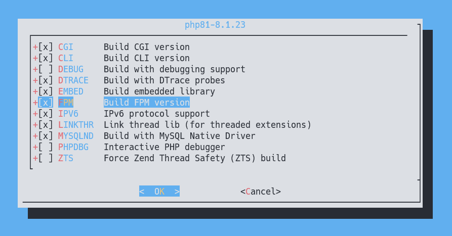
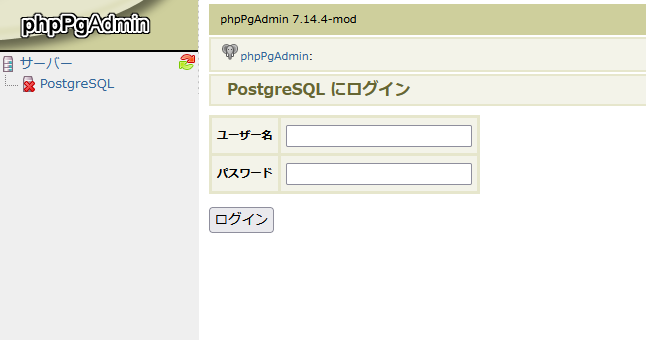

# FreeBSD13.2にPostgreSQL 15をインストールする（後編）

Author: Amasaki Shinobu (雨崎しのぶ)

Twitter: [@amasaki203](https://twitter.com/amasaki203)

Posted on: 2023-09-14 JST


## 概要

本稿では、FreeBSD 13.2のサーバーに、前編でインストールしたPostgreSQLについて、phpPgAdminを経由してウェブブラウザ上からアクセスする方法について、できるだけ詳細に述べる。

ウェブサーバーApache HTTP Server 2.4（`apache24`）とPHP FastCGI Process Manager（`php-fpm`）をインストールして、ウェブアプリケーションphpPgAdminを実行できる環境を提供するのが本稿の目標である。

## 目次

- [概要](#概要)
- [目標](#目標)
- [インストールする環境](#インストールする環境)
- [前準備](#前準備)
  - [ユーザーとデータベースの追加](#ユーザーとデータベースの追加)
  - [PHP 8.1をインストールする](#php-8.1をインストールする)
  - [Apache HTTP Server 2.4をインストールする](#apache-http-server-2.4をインストールする)
- [phpPgAdminをインストールする](#phppgadminをインストールする)
- [phpPgAdminへアクセスする](#phppgadminへアクセスする)
  - [Webサーバーを起動する](#webサーバーを起動する)
  - [ブラウザでphpPgAdminを開く](#ブラウザでphppgadminを開く)

## 目標

前編ではPostgreSQLをインストールし、LAN内の他のホストからコマンドライン経由でアクセスすることを達成できた。続いて後編では、以下を目標に、その実行方法について述べる。

#### 後編の目標

- phpPgAdminをインストールして、LANのホストのブラウザからアクセスできるようにする。

これの実現には以下のWebサーバーパッケージをインストールして稼働させる必要がある。

- Apache HTTP Server（`apache24`）
- PHP FastCGI Process Manager（`php-fpm`）

## インストールする環境

以下にハードウェアとOS、ネットワークについての要点を挙げる。

- OS：FreeBSD 13.2-RELEASE   
  - シェルは`zsh`を使用する（コードブロックにはプロンプト`%`を使用していることに注意）
  - `sudo`が使用可能なことを前提とする。
- ハードウェア：Fujitsu Esprimo D583/KX   
  - メモリ：DDR3 32GB
  - CPU: Intel(R) Core(TM) i5-4590 CPU @ 3.30GHz (4コア)
  - ストレージ：Sandisk SSD Plus 240GB
  - NIC   
    - Intel(R) PRO/1000 PT 82572EI (Copper)
    - RealTek 8168/8111 PCIe Gigabit Ethernet
- ネットワーク   
  - Intel: 192.168.0.243/24
  - RealTek: 192.168.11.13/24
  - 192.168.0.0/24ネットワークと192.168.11.0/24ネットワークはブリッジを介して接続されている。

## 前準備

### ユーザーとデータベースの追加

PostgreSQLサーバーにユーザー（ロール）とデータベースを追加する。

ここではユーザー`shinobu`と、データベース`sandbox`を追加することにする。

最初に、`creteuser`コマンドでユーザー`shinobu`を追加する。

```shell
% createuser -h localhost -U postgres shinobu
```

このコマンドは`localhost`のPostgreSQLサーバーに、管理者`postgres`の権限でアクセスし、新規ユーザー`shinobu`を追加するコマンドである。

新規ユーザーにパスワードを設定するには、データベースに`psql`コマンドでアクセスして、以下のように設定する。

```shell
% psql -h localhost -U shinobu postgres
psql (15.4)
Type "help" for help.

postgres=> alter role shinobu with password 'hogepasswdfuga';
ALTER ROLE
```

パスワード文字列`hogepasswdfuga`は各々自分のものに読み替えて設定して欲しい。


次に、`cretedb`コマンドでデータベース`sandbox`を作成する。

```shell
% createdb -h localhost -U postgres sandbox
```

このコマンドは`localhost`のPostgreSQLサーバーに、管理者`postgres`の権限でアクセスし、新規データベース`sandbox`を追加するコマンドである。


### PHP 8.1をインストールする

php 8.1（`php81`）をportsからインストールする。

```shell
% cd /usr/ports/lang/php81
% sudo make config
```

設定画面は次の通り。ここで`FPM`にチェックが入っていることを確認して、ビルドを実行する。

::: {class=large-img}



:::

ビルドを実行する（依存関係のパッケージの設定はデフォルトで進めることにする）。

```shell
% sudo make
```

`gettext-runtime`など、`php81`が要求するよりも古いバージョンのパッケージがすでにインストールされている場合は、当該パッケージのディレクトリに行き、そこで`make deinstall`を実行してアンインストールをした上で、再び`php81`のディレクトリで`make`コマンドを実行する必要がある。

以下のような出力がなされれば、`php81`のビルドは完了である。

```shell
--- all ---

Build complete.
Don't forget to run 'make test'.
===>  Staging for php81-8.1.23
===>   Generating temporary packing list
Installing PHP SAPI module:       embed
Installing PHP CLI binary:        /usr/ports/lang/php81/work/stage/usr/local/bin/
Installing PHP CLI man page:      /usr/ports/lang/php81/work/stage/usr/local/man/man1/
Installing PHP FPM binary:        /usr/ports/lang/php81/work/stage/usr/local/sbin/
Installing PHP FPM defconfig:     /usr/ports/lang/php81/work/stage/usr/local/etc/
Installing PHP FPM man page:      /usr/ports/lang/php81/work/stage/usr/local/man/man8/
Installing PHP FPM status page:   /usr/ports/lang/php81/work/stage/usr/local/share/php/fpm/
Installing phpdbg binary:         /usr/ports/lang/php81/work/stage/usr/local/bin/
Installing phpdbg man page:       /usr/ports/lang/php81/work/stage/usr/local/man/man1/
Installing PHP CGI binary:        /usr/ports/lang/php81/work/stage/usr/local/bin/
Installing PHP CGI man page:      /usr/ports/lang/php81/work/stage/usr/local/man/man1/
Installing build environment:     /usr/ports/lang/php81/work/stage/usr/local/lib/php/build/
Installing header files:          /usr/ports/lang/php81/work/stage/usr/local/include/php/
Installing helper programs:       /usr/ports/lang/php81/work/stage/usr/local/bin/
  program: phpize
  program: php-config
Installing man pages:             /usr/ports/lang/php81/work/stage/usr/local/man/man1/
  page: phpize.1
  page: php-config.1
====> Compressing man pages (compress-man)
===> Staging rc.d startup script(s)
```

`make install`でインストールを実行する。

```shell
% sudo make install
===>  Installing for php81-8.1.23
===>  Checking if php81 is already installed
===>   Registering installation for php81-8.1.23
Installing php81-8.1.23...
===> SECURITY REPORT:
      This port has installed the following files which may act as network
      servers and may therefore pose a remote security risk to the system.
/usr/local/lib/libphp.so
/usr/local/bin/php
/usr/local/bin/php-cgi
/usr/local/sbin/php-fpm

      If there are vulnerabilities in these programs there may be a security
      risk to the system. FreeBSD makes no guarantee about the security of
      ports included in the Ports Collection. Please type 'make deinstall'
      to deinstall the port if this is a concern.

      For more information, and contact details about the security
      status of this software, see the following webpage:
https://www.php.net/
```

#### `php-fpm`の起動

php-fpmの設定ファイル`/usr/local/etc/php-fpm.d/www.conf`を見ると、`php-fpm`のリスニングポートは`9000`番であることを確認できる。これは、後でApacheのプロキシ設定を行う際に必要となるので覚えておく。

```shell
% grep "^listen =" /usr/local/etc/php-fpm.d/www.conf
listen = 127.0.0.1:9000
```

次に、`/etc/rc.conf`に`php_fpm_enable="YES"`を記述してスタートアップを有効にする。

```shell
% sudo vi /etc/rc.conf
php_fpm_enable="YES"
```

最後に`php-fpm`のサービスを起動してPHPのインストールは完了である。

```shell
% sudo service php-fpm start
Performing sanity check on php-fpm configuration:
[13-Sep-2023 19:43:28] NOTICE: configuration file /usr/local/etc/php-fpm.conf test is successful

Starting php_fpm.
```

### Apache HTTP Server 2.4をインストールする

Apache HTTP Server 2.4（通称Apache2、FreeBSDでは`apache24`）は、ここではデフォルトのビルドオプションで構わないため、`pkg`コマンドでインストールすることにする。もし必要があれば、portsでインストールしてもよい。

```shell 
% sudo pkg install apache24

Message from apr-1.7.3.1.6.3_1:

--
The Apache Portable Runtime project removed support for FreeTDS with
version 1.6. Users requiring MS-SQL connectivity must migrate
configurations to use the added ODBC driver and FreeTDS' ODBC features.
=====
Message from apache24-2.4.57_1:

--
To run apache www server from startup, add apache24_enable="yes"
in your /etc/rc.conf. Extra options can be found in startup script.

Your hostname must be resolvable using at least 1 mechanism in
/etc/nsswitch.conf typically DNS or /etc/hosts or apache might
have issues starting depending on the modules you are using.


- apache24 default build changed from static MPM to modular MPM
- more modules are now enabled per default in the port
- icons and error pages moved from WWWDIR to DATADIR

   If build with modular MPM and no MPM is activated in
   httpd.conf, then mpm_prefork will be activated as default
   MPM in etc/apache24/modules.d to keep compatibility with
   existing php/perl/python modules!

Please compare the existing httpd.conf with httpd.conf.sample
and merge missing modules/instructions into httpd.conf!
```

`apr`と`apache24`についてのメッセージが出る。ここでは後者のメッセージについて一つずつ読んでいこう。

> To run apache www server from startup, add `apache24_enable="yes"` in your /etc/rc.conf. Extra options can be found in startup script.

「スタートアップ時にapache Webサーバーを実行するには、`apache24_enable="yes"`を、あなたの`/etc/rc.conf`に記述してください。その他の選択肢はスタートアップスクリプトに記述されています。」

これに書かれている通り、`/etc/rc.conf`に記述する必要がある。他にも`apache24_http_accept_enable="YES"`を指定したいので、ここでは`/etc/rc.conf.d`ディレクトリに`apache24`ファイルを新規作成して、これらを記述することにする。

```shell
% sudo vim /etc/rc.conf.d/apache24
apache24_enable="YES"
apache24_http_accept_enable="YES"
```


続くメッセージは次の通り。

> Your hostname must be resolvable using at least 1 mechanism in /etc/nsswitch.conf typically DNS or /etc/hosts or apache might have issues starting depending on the modules you are using.

「あなたのホスト名は、通常はDNSまたは`/etc/hosts`などの`/etc/nsswitch.conf`に含まれる少なくとも1つのメカニズムを使用して名前解決可能である必要があります。そうではない場合、使用しているモジュールに応じて、Apacheが起動しないか問題が発生する可能性があります。」

今回はIPアドレスを指定してのアクセスしか想定していないので、この注意書きは無視することにする。


次に、

> - apache24 default build changed from static MPM to modular MPM
> - more modules are now enabled per default in the port
> - icons and error pages moved from WWWDIR to DATADIR
>
>    If build with modular MPM and no MPM is activated in
>    httpd.conf, then mpm_prefork will be activated as default
>    MPM in etc/apache24/modules.d to keep compatibility with
>    existing php/perl/python modules!

「以下の変更点があります：

- `apache24`のデフォルトビルドが静的MPMからモジュールMPMに変更されました。
- このportのデフォルトで、より多くのモジュールが有効になりました。
- アイコンとエラーページは、`WWWDIR`から`DATADIR`に移動しました。

モジュラーMPMでビルドし、`httpd.conf`でMPMが有効化されていない場合、既存のphp/perl/pythonモジュールとの互換性を維持するために、`etc/apache24/modules.d`内で`mpm_prefork`がデフォルトのMPMとして有効化されます。」

ここで、MPMとは、multi-processing module の略称で、Apacheの並列処理に関連するモジュールである。このモジュールには`prefork`/`worker`/`event`の3種類の振る舞いがあり、本稿では`event`を選択することにする。これはこのセクションの最後のコードリストで記述する。


最後に`httpd.conf`に関する注意書きがある。

> Please compare the existing `httpd.conf` with `httpd.conf.sample` and merge missing modules/instructions into `httpd.conf`!

「既存の`httpd.conf`と`httpd.conf.sample`を比較し、欠けているモジュールや指示を`httpd.conf`に統合してください！」

今回はApacheを新規インストールしたので古い`httpd.conf`は存在しない。


さて、上に述べてきた注意点を含めて、今回使用する`httpd.conf`は本セクションの最後に示す。

このファイルで重要な点は、次の部分である。

```apache
<FilesMatch "\.php$">
        SetHandler "proxy:fcgi://127.0.0.1:9000/"
</FilesMatch>
```

これは、拡張子`.php`へのリクエストを、`fcig://127.0.0.1:9000`に、すなわち`php-fpm`に渡して、PHPでの処理させることを指示するディレクティブである。これを記述しないとphpPgAdminは動作しない。

加えて、ここでphpPgAdminに関わるファイルについても述べておく。`httpd.conf`は、その最後の行に`Include`命令がある通り、`/usr/local/etc/apache24/Include`sディレクトリに含まれる`.conf`拡張子を持つファイルをインクルードする。このディレクトリに`phppgadmin.conf`ファイルを以下の通りに記述して作成しておく。

```apache
% sudo vim /usr/local/etc/apache24/Includes/phppgadmin.conf
Alias /phppgadmin "/usr/local/www/phpPgAdmin"
<Directory "/usr/local/www/phpPgAdmin">
    DirectoryIndex index.php
    AllowOverride All
    Options FollowSymlinks
    Require ip 192.168.0.0/24 192.168.11.0/24
</Directory>
```

このファイルでは、Webサーバーの`/phppgadmin`へのアクセスを、`/usr/local/www/phpPgAdmin`ディレクトリにエイリアスを作成して参照させることを指示している。ここで注意するのは、後で述べるが、phpPgAdminはそのアプリケーションファイルを`/usr/local/www/phpPgAdmin`にインストールすることである。

また、ディレクトリへのアクセスは`index.php`を参照するように指定している。これらにアクセスできるIPアドレスの範囲を、ローカルネットワークに限定している。


`httpd.conf`ファイルを示す：

```apache
% grep -v -e "^\s*#" -e "^\s*$" /usr/local/etc/apache24/httpd.conf
ServerRoot "/usr/local"
Listen 80
LoadModule mpm_event_module libexec/apache24/mod_mpm_event.so
LoadModule authn_file_module libexec/apache24/mod_authn_file.so
LoadModule authn_core_module libexec/apache24/mod_authn_core.so
LoadModule authz_host_module libexec/apache24/mod_authz_host.so
LoadModule authz_groupfile_module libexec/apache24/mod_authz_groupfile.so
LoadModule authz_user_module libexec/apache24/mod_authz_user.so
LoadModule authz_core_module libexec/apache24/mod_authz_core.so
LoadModule access_compat_module libexec/apache24/mod_access_compat.so
LoadModule auth_basic_module libexec/apache24/mod_auth_basic.so
LoadModule reqtimeout_module libexec/apache24/mod_reqtimeout.so
LoadModule filter_module libexec/apache24/mod_filter.so
LoadModule mime_module libexec/apache24/mod_mime.so
LoadModule log_config_module libexec/apache24/mod_log_config.so
LoadModule env_module libexec/apache24/mod_env.so
LoadModule headers_module libexec/apache24/mod_headers.so
LoadModule setenvif_module libexec/apache24/mod_setenvif.so
LoadModule version_module libexec/apache24/mod_version.so
LoadModule proxy_module libexec/apache24/mod_proxy.so
LoadModule proxy_fcgi_module libexec/apache24/mod_proxy_fcgi.so
LoadModule ssl_module libexec/apache24/mod_ssl.so
LoadModule unixd_module libexec/apache24/mod_unixd.so
LoadModule status_module libexec/apache24/mod_status.so
LoadModule autoindex_module libexec/apache24/mod_autoindex.so
LoadModule dir_module libexec/apache24/mod_dir.so
LoadModule alias_module libexec/apache24/mod_alias.so
IncludeOptional etc/apache24/modules.d/[0-9][0-9][0-9]_*.conf
<IfModule unixd_module>
User www
Group www
</IfModule>
ServerAdmin shinobu@localnet.home
<Directory />
    AllowOverride none
    Require all denied
</Directory>
DocumentRoot "/usr/local/www/apache24/data"
<Directory "/usr/local/www/apache24/data">
    Options FollowSymLinks
    AllowOverride All
    Require all granted
</Directory>
<IfModule dir_module>
    DirectoryIndex index.php index.html
</IfModule>
<Files ".ht*">
    Require all denied
</Files>
ErrorLog "/var/log/httpd-error.log"
LogLevel warn
<IfModule log_config_module>
    LogFormat "%h %l %u %t \"%r\" %>s %b \"%{Referer}i\" \"%{User-Agent}i\"" combined
    LogFormat "%h %l %u %t \"%r\" %>s %b" common
    <IfModule logio_module>
      LogFormat "%h %l %u %t \"%r\" %>s %b \"%{Referer}i\" \"%{User-Agent}i\" %I %O" combinedio
    </IfModule>
    CustomLog "/var/log/httpd-access.log" common
</IfModule>
<IfModule headers_module>
    RequestHeader unset Proxy early
</IfModule>
<IfModule mime_module>
    TypesConfig etc/apache24/mime.types
    AddType application/x-compress .Z
    AddType application/x-gzip .gz .tgz
</IfModule>
<IfModule proxy_html_module>
    Include etc/apache24/extra/proxy-html.conf
</IfModule>
<IfModule ssl_module>
SSLRandomSeed startup builtin
SSLRandomSeed connect builtin
</IfModule>
<FilesMatch "\.php$">
    SetHandler "proxy:fcgi://127.0.0.1:9000/"
</FilesMatch>
Include etc/apache24/Includes/*.conf
```

ここで、コメントアウト部分は含まれていないことに注意されたい。

## phpPgAdminをインストールする

さて、本題のphpPgAdminのインストールへ話題を移そう。

phpPgAdminのportは`/usr/ports/databases/phppgadmin`のディレクトリにある。

`make config`で設定できるオプションは存在しないので、そのまま`make`コマンドでビルドをして構わない。

```shell
% cd /usr/ports/databases/phppgadmin
% sudo make
% sudo make install
```

インストールすると、`/usr/local/www`ディレクトリに`phpPgAdmin`ディレクトリが作成され、そこにphpファイルなどからなるWebアプリケーションの本体となるファイルが配置される。

メインの設定ファイルは`conf/config.inc.php`であり、`classes/database/Connection.php`にはデータベースへの接続を管理する設定がある。

ここで後者にはPostgreSQLバージョン15に関するドライバーの記述が欠けているので、78行目付近に以下のように1行追加する。

```php
% sudo vi /usr/local/www/phpPgAdmin/classes/database/Connection.php
                // Detect version and choose appropriate database driver
                switch (substr($version,0,2)) {
                        case '15': return 'Postgres'; break; // <-- NEW
                        case '14': return 'Postgres'; break;
                        case '13': return 'Postgres13'; break;
                        case '12': return 'Postgres12'; break;
                        case '11': return 'Postgres11'; break;
                        case '10': return 'Postgres10'; break;
                }
```

cf. [Debian 12 Bookworm : PostgreSQL 15 : phpPgAdmin インストール : Server World](https://www.server-world.info/query?os=Debian_12&p=postgresql&f=6)

## phpPgAdminへアクセスする

### Webサーバーを起動する

ここでApache24を起動する。
```shell
% sudo service apache24 start
```

起動メッセージに

```shell
Syntax OK
Starting apache24.
```

と表示されれば、起動は完了である。

ここで上のセクションで起動しておいた`php-fpm`のサービスの状態を確認しておこう。次のコマンドを実行する。

```shell
% service php-fpm status
php_fpm is running as pid 5477.
```

実行中のプロセスIDが表示されれば正常に動作している。

### ブラウザでphpPgAdminを開く

ブラウザのURLに`http://192.168.11.13/phppgadmin`と入力して、以下の画面が表示されれば成功である。

::: {class=large-img}


:::

「サーバー」を選択するとログイン画面が表示される。

::: {class=large-img}



:::

上のセクションで作成しておいたユーザー名とパスワードを入力する。画面が遷移して、データベース`sandbox`が表示されているのを確認できれば、本稿の目標は達成された。

::: {class=large-img}


:::
